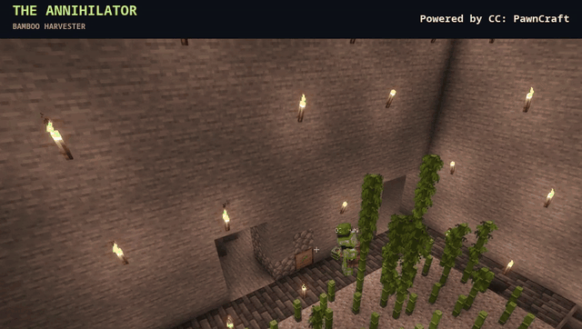
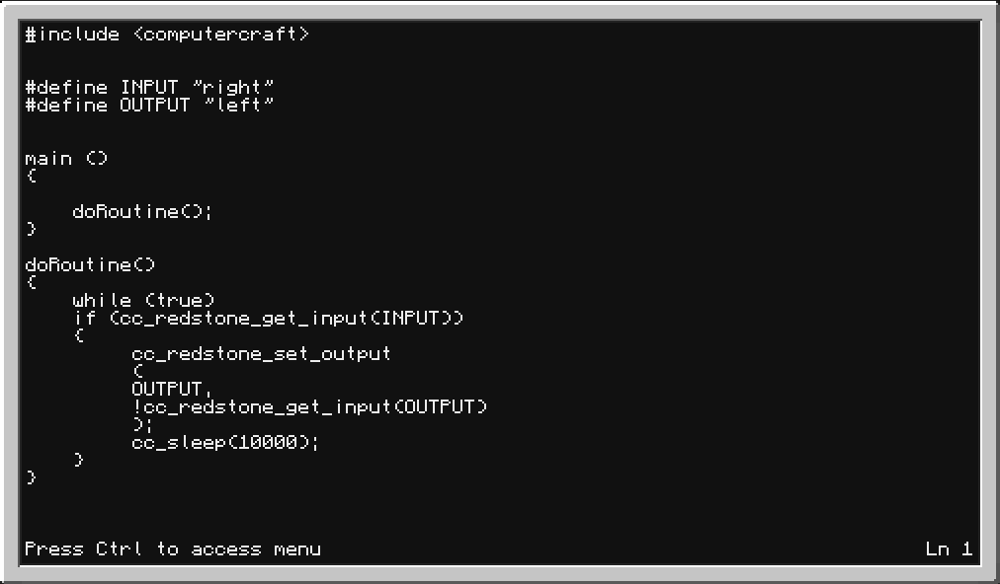
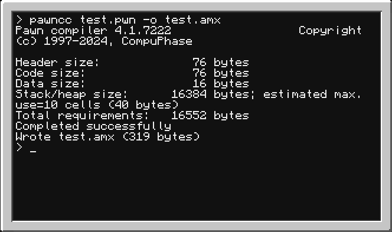

<div align="center">


# PawnCraft

**Write PAWN programs for [CC:Tweaked](https://tweaked.cc/).**

Compile in-game. Wire up redstone. Put your turtles to work.

[](https://github.com/Knogle/CC-PawnCraft/actions/workflows/build.yml)
[](#installation)
[](#installation)
[](#installation)
[](#installation)
[](#license)

[Install](#installation) · [Quickstart](#getting-started) · [Showcase](#in-game) · [User guide and API](docs/PAWN-GUIDE.md) · [Examples](examples) · [Build from source](#building)

</div>

PawnCraft adds a native PAWN compiler and AMX runtime to your ComputerCraft
computers and turtles. Your normal CraftOS terminal and Lua programs stay intact.

## Highlights

- **Redstone and turtles:** read inputs, switch outputs, and automate your builds.
- **Peripherals:** work with monitors, inventories, and other connected devices.
- **Events and data:** use timers, modem messages, files, and JSON.
- **PAWN tooling:** compile in-game, with string helpers, formatting, and float math.

## In game

### The Annihilator

<p align="center">
  <a href="docs/showcases/annihilator.md"></a>
</p>

A real bamboo harvester controlled by a PAWN redstone state machine.
[PAWN source](examples/annihilator2.pwn) · [How it works](docs/showcases/annihilator.md) · [MP4](assets/readme/annihilator.mp4) · [Still image](assets/readme/annihilator-poster.jpg)

### Writing and compiling

<table>
  <tr>
    <th>Editing PAWN in CraftOS</th>
    <th>Compiling to AMX</th>
  </tr>
  <tr>
    <td width="50%" valign="top">
      <a href="assets/readme/pawn-editor.png"></a>
    </td>
    <td width="50%" valign="top">
      <a href="assets/readme/pawn-compiler.png"></a>
    </td>
  </tr>
</table>

Click either image for full size. These early development screenshots predate
the current compiler's additional license notices; use the [examples](examples)
for tested programs.

## Installation

Tested with **Minecraft 1.21.1**, **NeoForge 21.1.248**, and **CC:Tweaked 1.120.2**.
The Minecraft host needs **Java 21**. The bundled native tools require
**Linux x86_64 with glibc 2.38 or newer**; Windows, macOS, and ARM binaries are
not included.

1. [Build the addon](#building) to obtain `pawncraft-0.4.1.jar`.
2. Stop your Minecraft instance and back it up.
3. Place the JAR in its `mods/` directory alongside CC:Tweaked.
4. Start Minecraft. Open a CC computer and run `help pawn` to check installation.

On dedicated servers, connecting players do not need the PawnCraft JAR.
The native-tool requirements apply to the machine running the world.

Upgrading from CC: PAWN? Remove the old `ccpawn-*.jar` first. Both names use
the same mod ID, `ccpawn`, and must not be installed together.

## Getting started

In a ComputerCraft terminal, create a source file:

```text
edit hello.pwn
```

Enter this program:

```pawn
#include <computercraft>

main()
{
    if (printf("Hello from PawnCraft!\n") < 0)
        return 1;
    return 0;
}
```

Press **Ctrl**, choose **Save**, then **Exit**. Compile and run:

```text
pawncc hello.pwn -o hello.amx
pawn hello.amx
```

Recompile after editing. Hold **Ctrl+T** to stop a running program.

For something more practical, try the [redstone controller](examples/ernter.pwn),
[countdown](examples/countdown.pwn), or [event loop](examples/events.pwn).
The [complete guide](docs/PAWN-GUIDE.md) covers all 93 public helpers, error
handling, monitors, peripherals, and complete programs. PawnCraft uses
CompuPhase PAWN 4.1, not the SA-MP/open.mp API.

## Building

You need Linux x86_64, JDK 21, CMake 3.20+, a C compiler, and Python 3.11+.
Run these commands on your development machine, not inside ComputerCraft:

```sh
git clone --recurse-submodules https://github.com/Knogle/CC-PawnCraft.git
cd CC-PawnCraft
./gradlew build
```

The output is `build/libs/pawncraft-0.4.1.jar`. The build runs local compiler,
VM, CraftOS integration, documentation, and packaging checks. It does not
start or contact a Minecraft server.

## Runtime limits

PAWN runs in a separate native process and accesses CC APIs through a Lua
bridge. This is not an operating-system sandbox: enable in-game compilation
only for players you trust. Computer shutdown or chunk unloading stops its
programs; PawnCraft does not keep chunks loaded.

See [limits and security](docs/PAWN-GUIDE.md#16-limits-lifecycle-and-security)
for memory limits, watchdog behavior, and deployment considerations.

## Contributing

Bug reports, fixes, documentation, and example programs are welcome.
[Open an issue](https://github.com/Knogle/CC-PawnCraft/issues) with your mod
versions, host OS, relevant logs, and a small reproduction. Run `./gradlew build`
before submitting code changes.

## License

PawnCraft's original code is [MIT licensed](LICENSE). The bundled CompuPhase
PAWN toolkit and the adapted `float.inc` retain their upstream
[license](licenses/pawn-LICENSE.txt) and [notices](licenses/pawn-NOTICE.txt).
The [license inventory](licenses/README.md) also covers the compiler's ISC code
and its system glibc dependency. These license texts and notices are included
in the built JAR and source archives.
NeoForge MDK attribution is retained in [TEMPLATE_LICENSE.txt](TEMPLATE_LICENSE.txt).
